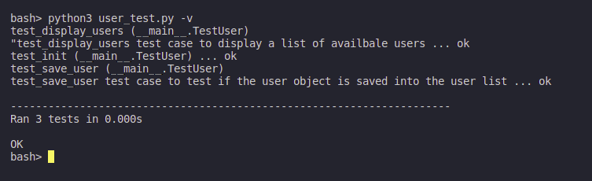
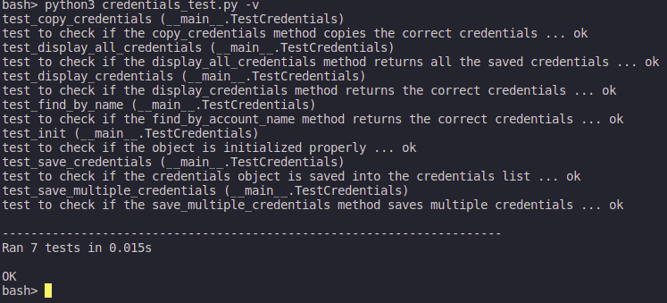

## Password Locker

A pass word locker application that allows users to store their passwords in a secure way.

This project is created using python only, and works on the Command Line only.

Project follows the TDD model and uses the unittest module to test the code.

## Requirements:

- Python 3.6 or above
- Command Line Interface

## Setup

- Install Python 3.6 or above
- Install pip: for installing python packages(pyperclip).
- Install pyperclip: for copying and pasting text.

## Running the application

- Run the application from the command line:
  > create an executable file:
  ```bash
  chmod +x run.py
  ```
  > running the application:
  ```bash
  ./run.py
  ```

### Test the application

- Run the **TestCases**:
  > run the test file for users class:
  ```bash
  python3 user_test.py -v
  ```
  

    
---
  > run the test file for password locker class:
  ```bash
  python3 credentials_test.py -v
  ```



## Features:
1. Create account
2. Log in
3. Add credentials
4. View credentials
5. Delete credentials

## To Do:
- create copy paste functionality

## License:
MIT License &copy; 2022 Willbeckh

#### Contact:
[Twitter](https://twitter.com/billyndirangu)
[LinkedIn](https://www.linkedin.com/in/willbeckh-ndirangu/)